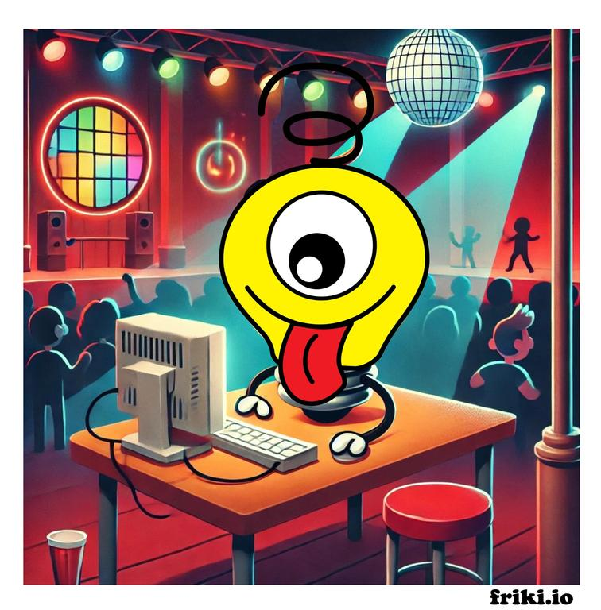

# Welcome to Friki's World! 💡

## Who is Friki? 

Friki is not just any lightbulb. Friki is a curious explorer, a traveler, and a dancer who loves to experience everything life has to offer. Whether it’s learning something new or working hard to achieve a goal, Friki always prioritizes growth and discovery. However, as an IT engineer, Friki often has to take on-call rotations and frequently receives alerts at the most inopportune times—during a concert, in the middle of a dance, or just before giving a kiss to someone special.

## Why Friki Does What He Does

These constant interruptions have sparked a new mission in Friki’s bright mind: to help reduce the burden of on-call rotations by contributing to open-source software. Friki is dedicated to creating tools that make life easier for IT professionals, allowing them to focus more on living and less on constantly acknowledging alerts during their on-call rotations.

## Our Mission 

Make the world a brighter place by helping with tips and tools that can be used to reduce on-call rotation. 